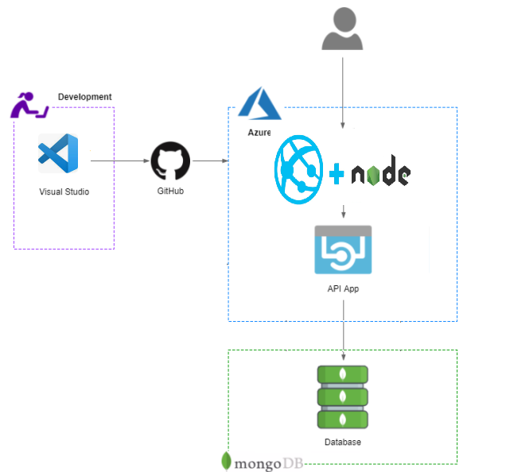

# Ejercicio Mutantes - Mercadolibre

Ejercicio práctico para MercadoLibre.

- [Ejercicio](#ejercicio)
  - [Implementación y tecnologias usadas](#implementaci%C3%B3n-y-tecnologias-usadas)
  - [Comentarios relevantes](#comentarios-relevantes)
- [Setup](#setup)
  - [Instrucciones](#instrucciones)
  - [Uso](#uso)
  - [API Url](#api)
  - [Servicios](#servicios)
    - [Healt](#Health)
    - [Mutantes](#Mutantes)
    - [Estadisticas](#Estadisticas)
    - [Transacciones](#Transacciones)
- [Test](#test)
  - [Automaticos](#automaticos)
  - [Scripts](#scripts)
  - [Cobertura](#cobertura)
- [Algoritmo](#Algoritmo)

## Ejercicio

### Implementacion y tecnologias usadas

- [NodeJs](https://nodejs.org/es/)
- [MongoDB](https://www.mongodb.com)
- [Jest](https://www.npmjs.com/package/jest)
- [Winston](https://www.npmjs.com/package/winston)
- [Express](https://www.npmjs.com/package/express)

### Comentarios

Cuando empece a realizar el proyecto, tenia experiencia realizando despliegues en node usando azure por lo cual para desarrollar el ejercicio me decante por esta tecnologia.

La implementacion de la misma utiliza una estructura similar al modelo MVC y entities para poder construir los objetos que se iban a insertar dentro de la base de datos

## Setup

### Instrucciones

Para poder ejecutar este proyecto es necesario tener instalado node en su local (en mi caso es la versión 14.15.1), ademas se debe tener una instancia de mongo en local para poder realizar los inserts y las consultas requeridas.

Utilice winston (framework), pero construi una implementacion propia para poder almacenar los logs en la carpeta log del proyecto (esto lo hace automaticamente) y serviará para obtener información relevante de la ejecución del proyecto.

Para clonar este repositorio debemos utilizar el siguiente comando:

```
  git clone https://github.com/ammoraleso/mutants-api.git
```

El puerto por defecto de la API es 3000 pero esta contemplado usar el puerto de Azure una vez de desplego en la nube.

### Uso

Para iniciar la aplicación, asegúrese de cumplir con las instrucciones anteriores.

Una vez cumplidos los requerimientos debemos ir a la carpeta donde tenemos nuestro proyecto y ejecutar el siguiente comando para instalar las dependencias:

```
  npm install
```

Se debe tener en cuenta que se deberá tener un archivo .env en el cual se dará la ruta de la base de datos a la que se quiere apuntar, en este caso se añade un archivo .envExample para tomar la referencia y crear el .env, en la propiedad DATABASE_CONECTION se deberá asignar la url de la base de datos, en el caso local se hará de la siguiente manera:

```
DATABASE_CONECTION = mongodb://127.0.0.1:.27017/mutants
```

Una vez instaladas las dependencias se deberá correr el comando:

```
npm run start
```

Cuando el proyecto este corriendo en local deberá mostrar un mensaje similar al siguiente (si hay un error lo notificará en la consola):

```
2021-02-13 14:01:34 [mutants-api\index.js] info : initialize Mongo
2021-02-13 14:01:34 [database\database.js] info : Connection Established
2021-02-13 14:01:34 [mutants-api\index.js] info : Server is up on 3000
```

### API Url

URL local: http://localhost:3000

URL hosteada en Azure: https://mutants-api.azurewebsites.net/

### Servicios

#### Health

Permite determinar si el aplicativo se encuentra corriendo de una manera adecuada

- Get https://mutants-api.azurewebsites.net/health

Si todo esta correcto tendremos el siguiente response:

```
  Status - 200 OK
    {
        "Status": "Up",
        "description": "Api is running"
    }
```

#### Mutantes

Determina si el individuo es mutante o no

Request:

- POST https://mutants-api.azurewebsites.net/mutant

Request body (caso ADN mutante):

```
    {
        "dna":["ATGCGA", "CAGTGC", "TTATTT", "CGACGG", "GCGTCA", "TCACTG"]
    }
```

Response:

```
  Status - 200 OK
    {
        "Description": "El individuo es MUTANTE",
        "isMutant": true,
        "Status": "Ok"
    }
```

Request body (caso ADN humano):

```
    {
        "dna":["ATGCGA", "CACTGC", "TTATTT", "AGACGG", "GCGTCA", "TCACTG"]
    }
```

Response:

```
  403 Forbidden
    {
        "Description": "El individuo es MUTANTE",
        "isMutant": false,
        "Status": "Bad"
    }
```

Para este servicio hice pruebas con diferentes request:

```
NO MUTANTE :
    {
        "dna":["ATGCGA", "CAGTGC", "TTATTT", "AGACGG", "GCGTCA", "TCACTG"]
    }

    {
        "dna":["ATGCGA", "CACTGC", "TTATTT", "AGACGG", "GCGTCA", "TCACTG"]
    }

    {
        "dna":["ATGCGA", "CAGTGC", "TTATTT", "CGACGG", "GCGTCA", "TCACTG"]
    }

    {
        "dna" : ["AAAC", "ATCG", "GTCA", "GGGG"]
    }

    {
        "dna" : ["AAAC", "ATCG", "GTCT", "GGGG"]
    }

    {
        "dna" : ["AAAC", "ATCG", "GTCT", "AGGG"]
    }

MUTANTE :
    {
        "dna":["ATGCGA","CAGTGC","TTATGT","AGAAGG","CCCCTA","TCACTG"]
    }

    {
        "dna" : ["AAAA", "ATCG", "GTCA", "GGGG"]
    }

    {
        "dna" : ["AAAA", "TTTT", "GTCA", "GGGG"]
    }
```

#### Estadisticas

Request:

- GET https://mutants-api.azurewebsites.net/stats

Response: 200 (application/json)

```
{
    "count_mutants_dna": 4,
    "count_humans_dna": 5,
    "ratio": 0.8
}
```

Para crear este servicio utilice una colección adicional que se llama stats, y cada vez que añadia un individuo (que no existiera), actualizé la colección sumando 1 dependiendo si era mutante o humano, esto con el fin de no hacer un findAll sobre la colección de DNA pensando en que si habian muchos registros esto podria tener un costo muy elevado.

#### Transacciones

Cree un servicio asociado a una colección para poder determinar cuando se realizá un llamado a un endpoint para poder tracker información

- GET https://mutants-api.azurewebsites.net/transactions

Response: 200 (application/json)

```
[
    {
        "_id": "602811449b8fd115dcff0c85",
        "transaction": "/stats",
        "date": "2021-02-13T17:49:56.684Z"
    },
    {
        "_id": "602811449b8fd115dcff0c86",
        "transaction": "/isMutant",
        "date": "2021-02-13T17:49:56.705Z"
    }
]
```

### Test

#### Automaticos

Para la creacion y ejecucion de test utilice Jest y Supertest donde mockee todos los elementos necesarios (teniendo en cuenta la BD) para asi poder llegar al coverage estimado.

En este caso intente tener el mayor coverage posible y logré el 100% según lo que muestrán los test locales.


#### Algoritmo

Para realizar el algorimo lo hice de la siguiente manera:


Consideraciones:

    - Recorrer la matriz hasta tener mas de 1 secuencia y terminar el procedimiento

    - Se recorren las matrices inferiores y superriores en los dos sentidos

    - Aprovechar la matriz NXN para poder recorrerla de manera horizontal y vertical

#### Desplieque

Para esto se utilizo el siguiente modelo:


